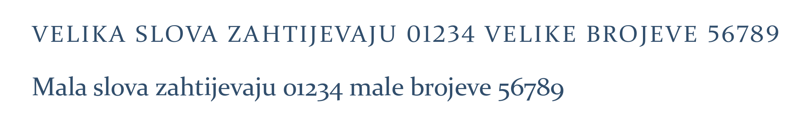
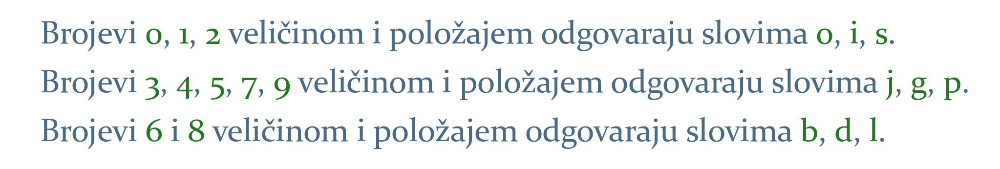
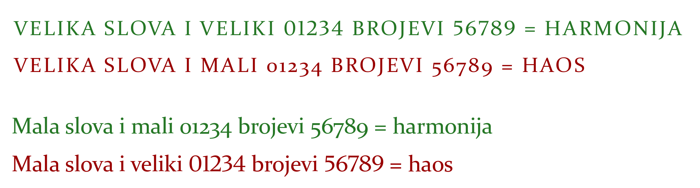
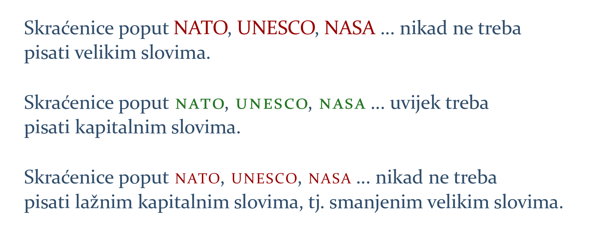

# Brojevi – vrste i kombinovanje

Najvažniji zadatak knjižnog dizajnera jest kreiranje harmonije na stranicama knjige, što uvelike zavisi od toga je li ostvaren sklad između slova i brojeva ili ne.

Pravilo je u tom pogledu konkretno i jednostavno: ako je tekst pisan velikim slovima (npr. naslovi), tada će se koristiti i »veliki« brojevi (engl. titling figures). U svim drugim situacijama koristit će se »mali« brojevi (engl. text figures):

Karakteristika je velikih slova, kao i velikih brojeva, da su jednake veličine i bez varijacija u položaju. Uočljiva su na stranici, što ih čini pogodnim za naslove, ali ne i za obični tekst: velika slova otežavaju raspoznavanje oblika riječi, neugodna su za duže čitanje i zamaraju oko.

Kod malih slova, s druge strane, postoje varijacije i u veličini i u položaju. Mala su slova dizajnirana na taj način da bi se oblik riječi što lakše prepoznao i olakšalo čitanje. Neka su mala slova manja (npr. i), neka veća (npr. d), neka se protežu iznad linije (npr. b), a neka ispod (npr. g).

Kako veliki brojevi odudaraju od teksta pisanog malim slovima, dizajnirani su
mali brojevi, koji se, s obzirom da su sličnih karakteristika kao i mala slova,
savršeno uklapaju u tekst.

Korištenje odgovarajućih brojeva u datom kontekstu neophodno je da bi se ostvarila harmonija na stranici. Neprepoznavanje veze između slova i brojeva rezultirat će nastankom haosa:

Ostvarenje harmonije na stranici zavisit će i od toga jesu li korištene ne samo odgovarajuće vrste brojeva, već i slova: pisanjem jedne ili više riječi velikim slovima u tekstu napisanom malim slovima narušit će se harmoničnost teksta. Da bi se to izbjeglo, dizajnirana je posebna vrsta velikih slova, »kapitalna« slova (engl. small caps), koja neće kreirati haos, već će se uklopiti u okolni tekst:

Ipak, treba naglasiti da veliki broj aplikacija ne koristi prava kapitalna slova, već generiše lažna putem smanjenja velikih slova. Ovakva slova veoma su uočljiva usljed istanjenih linija i odudaraju od teksta. Lažna kapitalna slova nipošto ne treba koristiti u tekstu.

Svaki dizajner treba znati kad se koja vrsta slova i brojeva koristi, jer će njihovo nasumično i neselektivno korištenje u tekstu kreirati rogobatnost i kič.

***

[Prilog o slaganju brojeva i slova](https://drive.google.com/file/d/1gwnr9JFqrxVsHYWVvU-WLmHGY9Ay4UVO/view?usp=sharing). Preuzeto iz: 
1. Robert Bringhurst, *The Elements of Typographic Style*, 3rd Ed.
2. Ellen Lupton, *Thinking With Type*, 2nd Ed.
