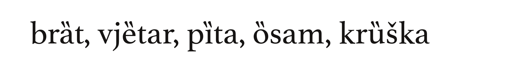
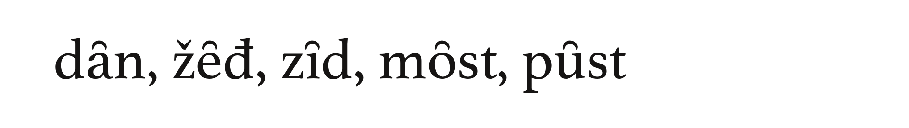
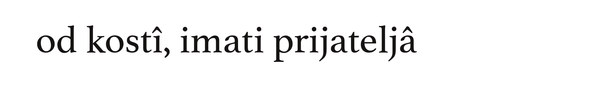

# Akcenti i genitivni znak

Riječi su sastavljene od slogova, a slogovi se izgovaraju različito: prilikom izgovora nekih slogova glas se podiže, prilikom drugih spušta, a to znači da su nejednaki po jačini _intonacije_. Isticanje jednog sloga u riječi jačinom i visinom glasa naziva se _akcent_ ili _naglasak_. U bosanskome jeziku razlikujemo četiri akcenta:

1. **kratkosilazni akcent**: slog se izgovara kratko, pri čemu jačina i visina tona naglo i istovremeno padaju:

2. **kratkouzlazni akcent**: slog se izgovara kratko, pri čemu jačina tona opada a visina raste:

3. **dugosilazni akcent**: slog se izgovara dugo, pri čemu jačina i visina tona istovremeno padaju:

4. **dugouzlazni akcent**: slog se izgovara dugo, pri čemu jačina i visina tona rastu:

## Nenaglašeni slogovi

Nenaglašeni kratki slogovi obično se ne označavaju nikakvim znakom. Nenaglašeni dugi slogovi mogu se, kada se za tim ukaže potreba, obilježavati crtom iznad slova:

## Genitivni znak

Genitivni znak stavlja se na zadnji vokal riječi u genitivu množine kada je potrebno ukazati na razliku ovog oblika od drugih s kojima je inače sličan:

Umjesto genitivnog znaka može se koristiti i crta za obilježavanje dugih nenaglašenih slogova.

## Greške prilikom obilježavanja akcenata

Kratkouzlazni i dugouzlazni akcenti obično su u tekstu napisani kako treba, što nije slučaj sa kratkosilaznim i dugosilaznim – za obilježavanje ova dva akcenta nerijetko se koriste pogrešne oznake, pa se kratkosilazni akcent nekada obilježava dvjema tačkama iznad slova umjesto dvjema kosim crticama, dok se znak za obilježavanje dugosilaznog akcenta gotovo redovno brka sa genitivnim znakom:

Stoga svaki savjesni dizajner knjige treba pažljivo pročitati tekst i korigovati sve oznake koje nisu upotrijebljene na odgovarajući način, a to uključuje i pravilno označavanje akcenata.

