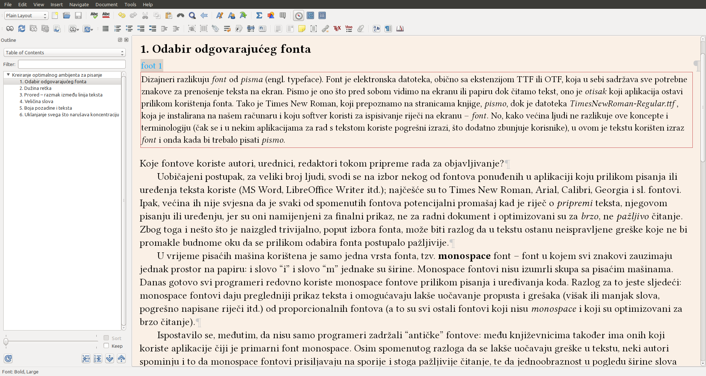
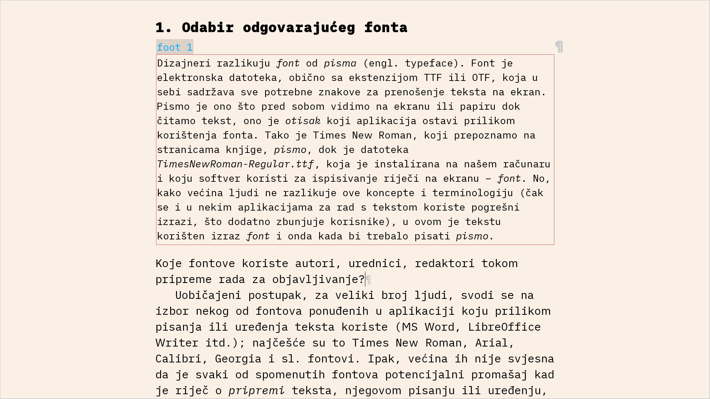
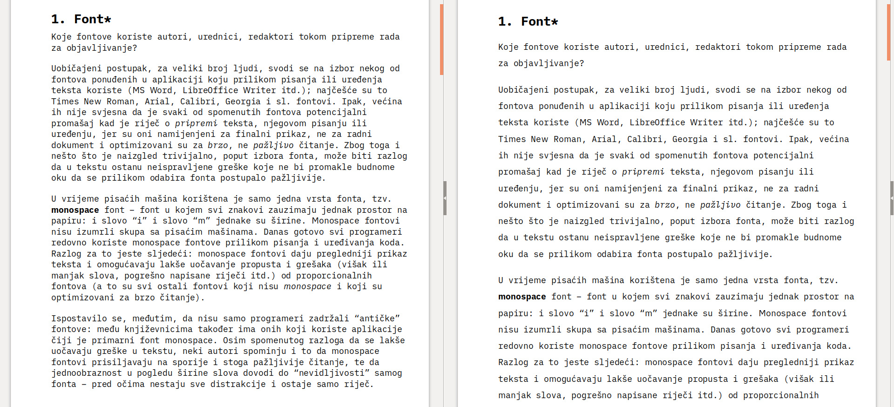
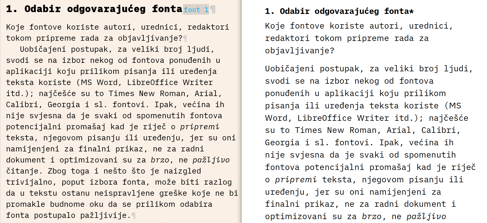

# Kreiranje optimalnog ambijenta za pisanje i uređenje teksta

### 1. Odabir odgovarajućeg fonta\*

Koje fontove koriste autori, urednici, redaktori tokom pripreme rada za objavljivanje?

Uobičajeni postupak, za veliki broj ljudi, svodi se na izbor nekog od fontova ponuđenih u aplikaciji koju prilikom pisanja ili uređenja teksta koriste \(MS Word, LibreOffice Writer itd.\); najčešće su to Times New Roman, Arial, Calibri, Georgia i sl. fontovi. Ipak, većina ih nije svjesna da je svaki od spomenutih fontova potencijalni promašaj kad je riječ o _pripremi_ teksta, njegovom pisanju ili uređenju, jer su oni namijenjeni za prikaz finaliziranog dokumenta, ne za njegovu radnu verziju i optimizovani su za _brzo_, ne _pažljivo_ čitanje. Zbog toga i nešto što je naizgled trivijalno, poput izbora fonta, može biti razlog da u tekstu ostanu neispravljene greške koje ne bi promakle budnome oku da se prilikom odabira fonta postupalo pažljivije.

U vrijeme pisaćih mašina korištena je samo jedna vrsta fonta, tzv. **monospace** font – font u kojem svi znakovi zauzimaju jednak prostor na papiru: i slovo “i” i slovo “m” jednake su širine. Monospace fontovi nisu izumrli skupa sa pisaćim mašinama. Danas gotovo svi programeri redovno koriste monospace fontove prilikom pisanja i uređivanja koda. Razlog za to jeste sljedeći: monospace fontovi daju pregledniji prikaz teksta i omogućavaju lakše uočavanje propusta i grešaka \(višak ili manjak slova, pogrešno napisane riječi itd.\) od proporcionalnih fontova \(a to su svi ostali fontovi koji nisu _monospace_ i koji su optimizovani za brzo čitanje\).

Ispostavilo se, međutim, da nisu samo programeri zadržali “antičke” fontove: među književnicima također ima onih koji koriste aplikacije čiji je primarni font monospace. Osim spomenutog razloga da se lakše uočavaju greške u tekstu, neki autori spominju i to da monospace fontovi prisiljavaju na sporije i stoga pažljivije čitanje, te da jednoobraznost u pogledu širine slova dovodi do “nevidljivosti” samog fonta – pred očima nestaju sve distrakcije i ostaje samo riječ.

Monospace fontovi idealni su za pisanje, oni nas već i samim svojim izgledom podsjećaju da naš posao još nije završen. Proporcionalni fontovi jasno nam daju do znanja da pred sobom imamo završen tekst koji još samo preostaje – pročitati.

Neki od kvalitetnijih monospace fontova jesu sljedeći: [iA Writer Duospace](https://www.fontsquirrel.com/fonts/ia-writer-duospace), [Source Code Pro](https://www.fontsquirrel.com/fonts/source-code-pro), Consolas \(koji se isporučuje uz novije Windows operativne sisteme\).

### 2. Dužina retka

Nakon izbora odgovarajućeg fonta, sljedeći važan faktor, koji će u znatnoj mjeri olakšati rad sa tekstom, jest prikladna dužina retka: tipografsko pravilo koje kaže da linija teksta ne bi smjela sadržavati više od **75** znakova, uključujući i razmake, validno je i prilikom pisanja i uređenja teksta: širinu stranice \(ili prozora aplikacije koja se koristi\) treba prilagoditi tako da reci ne budu predugi, jer ništa tako efikasno ne ubija volju i koncentraciju kako to čine predugi reci \(uporediti slike [1](ambijent-za-pisanje-i-obradu-teksta.md#1-odabir-odgovarajuceg-fonta) i [2](ambijent-za-pisanje-i-obradu-teksta.md#1-odabir-odgovarajuceg-fonta)\).

Iako se spomenuto tipografsko pravilo odnosi prvenstveno na finalni dokument, stranicu knjige, njegova je priroda praktičnā i primjenjuje se i na web-stranice, ali i sve druge vrste dokumenata, uključujući i radne.


Idealna dužina retka iznosi **66** znakova, a minimalna **45** znakova. Neki su dizajneri stava da se prihvatljiva dužina retka nalazi između 40 i 70 znakova, dok je idealna 56 ili, prema drugima, 60 znakova.


###  3. Prored – razmak između linija teksta

U knjigama, prored je obično jednostruk, iznosi **1**. Međutim, kada se tekst piše, pregleda i koriguje, jednostruki prored najčešće će biti premalen i korisno je povećati ga. Nema neke precizne mjere u pogledu veličine proreda, ali su vrijednosti između **1,2** i **1,5** najčešće korištene u praksi.

Neki autori i dalje praktikuju dvostruki prored, koji je bio pravilo kada su za pisanje korištene pisaće mašine – prazni prostor služio je za opaske urednika i lektora. Kako su danas u praksi zastupljeni drugi metodi za korekciju teksta i pisanje opaski, makar kad se radi o elektronskim dokumentima, dvostruki prored izgubio je svrhu i rijetko se koristi.

### 4. Veličina slova

Standardna veličina slova za štampane knjige iznosi 9 ili 10 pt, dok se veličina od 11 pt obično posmatra kao praktični maksimum za obični tekst \(u knjigama namijenjenim za malu djecu i stare osobe veličina slova može biti znatno veća, čak i 14 ili 16 pt\).

Standardna veličina slova u dopisima, memorandumima, raznima aktima, kancelarijskim dokumentima i korespodenciji, kao i seminarskim radovima i esejima iznosi 12 pt \(a to je zadatā vrijednost u većini aplikacija za obradu teksta\), što je, izuzev u rijetkim slučajevima, prevelika veličina slova za knjige.

Međutim, nijedna od spomenutih veličina nije podesna za pisanje teksta, njegovo uređenje i pripremu na računaru – minimalna veličina slova ovdje bi iznosila 16 pt, dok se 20 pt smatra standardnom veličinom za web-stranice, a to je ujedno i preporučena veličina za radnu verziju dokumenata. 

[Slika 2](ambijent-za-pisanje-i-obradu-teksta.md#1-odabir-odgovarajuceg-fonta) prikazuje tekst zadovoljavajuće veličine, dok je tekst prikazan na [slici 1](ambijent-za-pisanje-i-obradu-teksta.md#1-odabir-odgovarajuceg-fonta) isuviše sitan za ugodan rad.


Ne mora se uvijek mijenjati veličina slova u dokumentu da bi se omogućio ugodan rad. Mnoge aplikacije imaju mogućnost zumiranja, tj. povećavanja prikaza teksta bez mijenjanja njegove stvarne veličine. Zumiranje \(engl. zoom\) obično se nalazi u “View” meniju.


### 5. Boja pozadine i teksta

Boja pozadine može u manjoj ili većoj mjeri utjecati na rad sa tekstom, jer oko različito reaguje na boje i ostvareni kontrast između podloge i teksta. U principu, crni tekst na bijeloj pozadini najmanje opterećuje i zamara oko; tačnije, _tamni_ tekst na _svijetloj_ pozadini. Ovo je možda najsubjektivniji faktor od do sada navedenih i podložan je određenim varijacijama.

Savjeti u pogledu boje podloge i teksta mogu se svesti na sljedeće:

**1**. kontrast između teksta i pozadine treba biti dovoljno izražen da se oko ne mora naprezati kako bi razaznalo slova; slova se ne smiju slijevati u pozadinu \(npr. siva slova na malo svjetlijoj sivoj pozadini\), niti parati oko \(npr. jarkozelena slova na plavoj pozadini\);

**2**. iako je načelno najbolji izbor “crno na bijelom”, pokazalo se da čisto bijela podloga smeta oku mnogih čitalaca \(zbog čega se kvalitetne knjige štampaju na blago žućkastom papiru, ne čisto bijelom\), pa je dobro koristiti prljavo bijelu, blago žućkastu ili blago narandžastu boju umjesto čiste bijele;

**3**. kada se čita u mraku, korisno je obrnuti boje: za podlogu koristiti crnu ili tamnosivu, dok slova trebaju biti bijela ili blago žućkasta.

###  6. Uklanjanje svega što narušava koncentraciju

Posljednji korak u kreiranju optimalnog ambijenta za pisanje i uređenje teksta jest ukloniti iz vidokruga sve ono što bi moglo narušiti koncentraciju i na bilo koji način ometati misaoni proces. U praksi, to znači da treba privremeno isključiti sve obavijesti, zvučne ili vizuelne, o dospjelim porukama na koje nam razne aplikacije na našim računarima uredno skreću pažnju \(brojni autori prilikom pisanja koriste računar koji nema pristupa internetu, kako bi bili sigurni da ništa neće ometati kreativni proces\).

Osim sprečavanja raznih obavijesti, korisno je prilikom pisanja ukloniti i vizuelne elemente koji utječu na koncentraciju, a tu spadaju razni meniji, alatke, prozori, sličice koji su sastavni dio aplikacija za rad s tekstom. Većina aplikacija ima opciju za skrivanje svih neesencijalnih funkcija, bilo da se radi o zasebnom modusu ili običnoj “fullscreen” opciji, koja iz vidokruga uklanja sve elemente izuzev stranice s tekstom.

[Slika 2](ambijent-za-pisanje-i-obradu-teksta.md#1-odabir-odgovarajuceg-fonta) daje prikaz optimalnog okruženja za uređenje teksta u kojem su implementirani svi prethodno navedeni savjeti. [Slika 1](ambijent-za-pisanje-i-obradu-teksta.md#1-odabir-odgovarajuceg-fonta), s druge strane, daje prikaz tipičnog radnog okruženja s kojim se većina ljudi danas suočava, a koje je daleko od optimalnog. Tek nekoliko neznatnih intervencija dovoljno je da u znatnoj mjeri olakša njihov rad i poboljša njegov kvalitet.

### Bilješka

\* Dizajneri razlikuju _font_ od _pisma_ \(engl. typeface\). Font je elektronska datoteka, obično sa ekstenzijom TTF ili OTF, koja u sebi sadržava sve potrebne znakove za prenošenje teksta na ekran. Pismo je ono što pred sobom vidimo na ekranu ili papiru dok čitamo tekst, ono je _otisak_ koji aplikacija ostavi prilikom korištenja fonta. Tako je Times New Roman, koji prepoznamo na stranicama knjige, _pismo_, dok je datoteka _TimesNewRoman-Regular.ttf_, koja je instalirana na našem računaru i koju softver koristi za ispisivanje riječi na ekranu – _font_. No, kako većina ljudi ne razlikuje ove koncepte i terminologiju \(čak se i u nekim aplikacijama za rad s tekstom koriste pogrešni izrazi, što dodatno zbunjuje korisnike\), u ovom je tekstu korišten izraz _font_ i onda kada bi trebalo pisati _pismo_.

