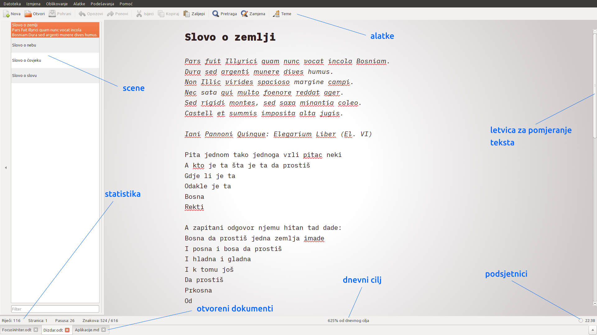
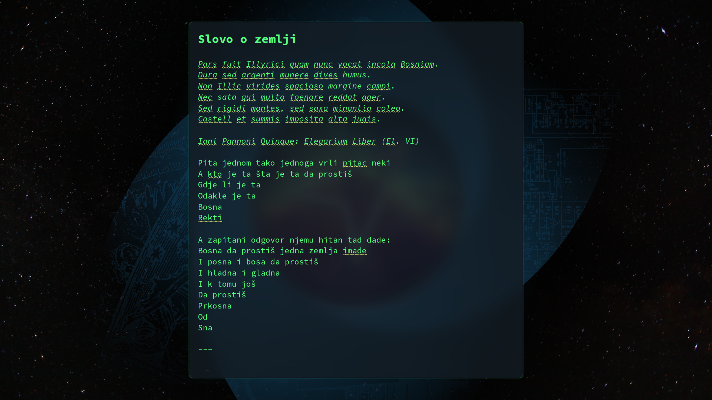
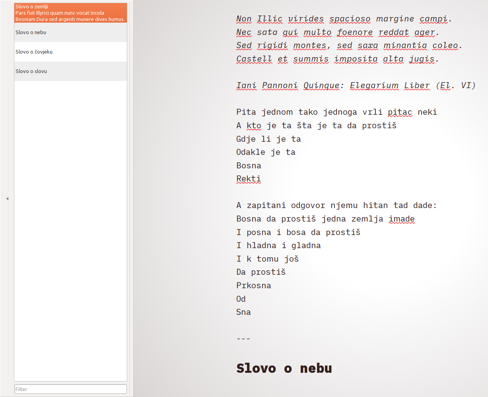
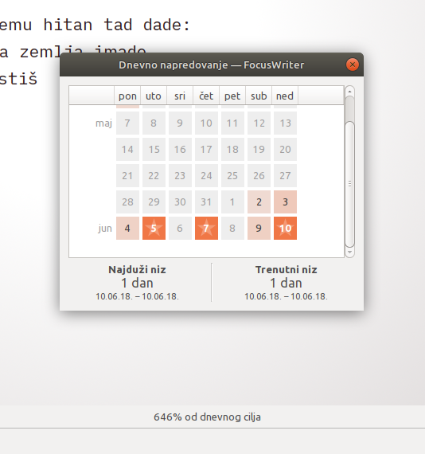

# FocusWriter

## Svrha aplikacija za pisanje

Svrha je svih aplikacija kreiranih za potrebe autorā obezbijediti ugodno okruženje za pisanje, spriječiti smetnje te, idealno, podstaknuti kreativnost.

Kako je većina popularnih aplikacija za rad s tekstom generičke prirode, kreirana za veliki broj pretpostavljenih slučajeva i situacija \(primarno za kancelarijski rad i redovno ignorišući potrebe autorā\), taj izostanak specijalizovanosti obično je za rezultat dao kruto i neimaginativno okruženje koje je teško ili nemoguće prilagoditi vlastitim potrebama. Zgražanje autora na kancelarijski softver koji dominira danas \(Microsoft Office Word\) rezultiralo je i pojavom sve većeg broja aplikacija specijalizovanih upravo za pisanje.

[FocusWriter](https://gottcode.org/focuswriter/?utm_source=next.36kr.com) je jedna od ovih aplikacija. Za temu ovog osvrta odabrao sam upravo ovu aplikaciju iz tri razloga:

1. izrazito je jednostavna za korištenje: čitava obuka traje svega nekoliko minuta, koliko je potrebno da se pregledaju meniji i dostupne mogućnosti aplikacije,
2. posjeduje sve opcije i alatke neophodne za pisanje; mogućnost kreiranja vizuelnih tema treba posebno istaknuti jer je njihov značaj neprocjenjiv,
3. objavljena je pod GPL3 licencom i svrstava se među slobodni i open-source softver.

Aplikacija se aktivno razvija od 2008. godine i dostupna je za sva tri glavna operativna sistema: Windows, Mac OS i Linux.

## Zašto i kada koristiti FocusWriter?

FocusWriter namijenjen je za pisanje prve radne verzije teksta. Iako se može koristiti i za uređivanje teksta, naročito ako je riječ o kraćim tekstovima, treba istaknuti da program nije kreiran u tu svrhu. Funkcija mu je očigledna već prilikom samog pokretanja programa: pred sobom ćemo vidjeti samo prostor za pisanje okružen pozadinom koja zauzima čitav ekran čime su iz vidokruga uklonjeni svi prozori, alatke i obavijesti koji su dio operativnog sistema.

## Karakteristike aplikacije

### Prikaz

FocusWriter kreiran je tako da prekriva čitav ekran, čime je iz vidokruga uklonjeno sve osim prostora za pisanje, kursora i pozadine. Svi elementi prozora otkrivaju se tek kad se kursor miša nadnese nad jednu od četiri ivice prozora:

– lijeva ivica otkriva popis scena,  
– desna ivica otkriva letvicu za pomjeranje teksta,  
– gornja ivica otkriva menije i alatke,  
– donja ivica otkriva popis otvorenih dokumenata i statističke podatke.

Spomenuti elementi mogu se prikazivati stalno, ako za tim postoji potreba, kroz aktiviranje odgovarajućih stavki u postavkama aplikacije.

### Tekst

FocusWriter tretira tekst kao integralnu misaonu cjelinu i ne dijeli ga na stranice. Jedina podjela teksta dostupna u aplikaciji jest na scene, koje se definišu ručno tako što će se u tekstu unijeti separator koji je naznačen u postavkama.

Iako program podržava definisanje naslova \(Heading 1 ... Heading 6\), radi kreiranja strukture teksta, kao i osnovne funkcije poput masnih slova, kurziva, eksponenta i indeksa itd., ipak treba ponoviti i naglasiti njegovu svrhu a to je pisanje, ne uređivanje teksta. Zbog toga uopće ne postoji podrška za tabele, fusnote, slike itd., jer se svi ovi elementi dodaju tek u fazi uređivanja teksta, nikada prilikom prve faze, faze pisanja.

### Teme

Teme su jedan od glavnih aduta FocusWritera. Umjesto okruženja uklesanog u kamenu, što je karakteristika većine aplikacija, FocusWriter je kreiranje i prilagođavanje ambijenta u potpunosti prepustio korisniku. Značaj ovakvog pristupa ne može se prenaglasiti. Upravo ova mogućnost kreiranja i izbora teme, kao i način implementacije, čini FocusWriter jednom od onih aplikacija koje su briljantne u svojoj jednostavnosti.

Tema je skup postavki koje određuju prikaz i rad aplikacije. Definisanjem teme korisnik oblikuje:

– izgled pozadine prozora \(jednobojna ili slika\),  
– izgled i dimenzije prostora za pisanje \(širina, visina, margine, font, providnost ...\),  
– prorede, prikaz teksta \(veličina, uvlačak, razmaci\).

Ogromna je korist tema. Ne samo što omogućavaju da se udovolji različitim ukusima korisnikā – neko lakše radi kad pred sobom nema ništa izuzev kursora na bijeloj ili crnoj pozadini, dok neko preferira fotografiju koja opušta ili čak kreira vizuelni haos – teme imaju i funkcionalni značaj. Tako se mogu kreirati teme za različita raspoloženja ili dijelove dana \(dan ili noć\), ali i za različite vrste teksta. Naprimjer, autor putopisa može u pozadinu staviti kartu onih regija koje opisuje, autor romana može u pozadinu staviti sliku prirode dok opisuje krajolik, autor genealogije može u pozadinu staviti sliku sa porodičnim stablom itd. Konačno, mogu se kreirati različite teme tek radi promjene ili poticaja na razmišljanje, jer je čovjekova priroda takva da se brzo zasiti gledanja u jednu te istu okolinu. Teme mogu poboljšati koncentraciju i djelovati inspirativno.

Na sljedećem linku mogu se vidjeti neka od mogućih vizuelnih rješenja: [https://photos.app.goo.gl/l11TF6w9X4E3GRdI3](https://photos.app.goo.gl/l11TF6w9X4E3GRdI3)

### Sesije

FocusWriter omogućava da se istovremeno otvori više dokumenata i oni su prikazani u donjem dijelu prozora \(pomjeranjem kolutića miša kad se kursor nadnese iznad trake s popisom otvorenih prozora, ili korištenjem kratice Ctrl+Tab, prolazimo kroz otvorene dokumente\). Svi otvoreni dokumenti ostaju otvoreni sve dok se ručno ne zatvore \(klikom na sličicu sa znakom “x” ili pomoću kratice Ctrl+F4\). Prilikom ponovnog pokretanja aplikacije svi ranije otvoreni dokumenti bit će ponovo otvoreni – i ne samo to, već će biti memorisana i pozicija na kojoj se kursor nalazio u svakom dokumentu prije zatvaranja programa, tako da se odmah može nastaviti sa pisanjem gdje se zadnji put stalo. Sve ove karakteristike, skupa sa aktivnom temom, čine sesiju.

Izuzetna korisnost sesija ogleda se u tome što one nude mogućnost grupisanja tekstova. Tako, naprimjer, autor može kreirati sesiju za roman koji piše i otvoriti sve datoteke koje su za njega relevantne: sva poglavlja, dokumente sa popisom imena glavnih i sporednih likova, lokacija, događaja itd. koje će biti automatski otvorene i dostupne prilikom svakog pokretanja aplikacije i koristeći odgovarajuću temu; za tekstove koje piše za lokalne novine može kreirati sesiju sa drugom temom i otvoriti datoteke koje su mu za pisanje članaka bitne; za dnevnik može kreirati zasebnu sesiju, itd. Mogućnosti su beskrajne.

Sesije se kreiraju i mijenjaju kroz meni File, odnosno Datoteka. Kratica za brzi pristup glasi: Ctrl+Shift+M. Strelicama se odabere sesija, a pritiskom na Enter ona se otvara.

### Scene

FocusWriter ne daje prikaz sadržaja, čak ni kada se dokument strukturira pomoću odgovarajućih naslova \(Headings\). Umjesto toga, program omogućava podjelu teksta na _scene_, koja može poslužiti za lakšu navigaciju kroz tekst.

Početak nove scene označava se korištenjem razdjelnice koja je definisana u postavkama aplikacije \(Settings &gt; Preferences &gt; General &gt; Scenes, odnosno Podešavanja &gt; Podešavanja &gt; Opća &gt; Scene\). Naprimjer, za odvajanje scena mogu se koristiti jedna ili više zvjezdica, ili crta, ili neki drugi znak, prema vlastitom odabiru. Autori koji koriste [markdown](http://commonmark.org/help/) notaciju prilikom pisanja mogu za razdjelnicu definisati znak \# i tako ustvari kreirati popis svih poglavlja, sekcija, podsekcija... – tipični sadržaj.

Sve scene prikazane su u lijevom dijelu ekrana \(Shift+F4\).

Scene se mogu premještati prevlačenjem mišem u popisu scena, a mogu se i markirati putem Edit &gt; Select Scene, odnosno Izmjena &gt; Označi scenu \(Ctrl+Shift+A\).

### Jezik

Iako provjeru pravopisa ne bi trebalo vršiti prilikom pisanja, FocusWriter ostavlja korisniku i tu mogućnost. Jezik teksta određuje se kroz Tools &gt; Set Language, odnosno Alatke &gt; Odredi jezik, a rječnik se podešava u postavkama aplikacije, odjeljak Spell Checking, odnosno Provjera pravopisa.

### Navodnici

Osim odabira vrste navodnika u općim postavkama programa, FocusWriter nudi mogućnost automatske zamjene ravnih navodnika koji su ostali u tekstu koji je kopiran iz druge aplikacije ili dokumenta. Zamjena navodnika vrši se kroz Tools &gt; Smart Quotes &gt; Update Document/Selection, odnosno Alatke &gt; Navodnici &gt; Ispravi u cijelom dokumentu ili označenom tekstu.

Prilikom kucanja teksta, FocusWriter uvijek koristi prave navodnike koji su odabrani u postavkama programa.

### Statistički podaci

U donjem lijevom dijelu prozora prikazani su statistički podaci koji kazuju koliko dokument ima:

– riječi,  
– stranica,  
– pasusa i  
– znakova \(bez razmaka / sa razmakom\).

Koji će od ovih podataka biti prikazani definiše se u postavkama programa, u odjeljku Statistika. Na istom se mjestu mogu definisati i načini mjerenja nekih od ovih podataka. Naprimjer, broj riječi može se utvrditi kao stvarni broj ili prosječni \(ukupan broj znakova podijeljen sa šest\), dok se broj stranica može utvrditi na osnovu broja znakova, paragrafa ili riječi.


Ako se za utvrđivanje broja stranica definiše 1500 ili 1800 znakova, tad će jedna stranica predstavljati jednu karticu.


### Dnevni cilj

Vičnost pisanju rezultat je prakse. Mnogi autori nastoje pisati svakodnevno kako bi stekli naviku i ispekli zanat. FocusWriter omogućava utvrđivanje dnevnog cilja u pogledu pisanja, gdje se može odrediti koliko se vremena dnevno želi provoditi pišući ili koliko će se riječi dnevno pisati.

FocusWriter prati aktivnosti i u donjem središnjem dijelu prozora pokazuje procenat u kojem je zadati dnevni cilj ostvaren.

Klikom na procenat \(ili Tools &gt; Daily progress, odnosno Alatke &gt; Dnevno napredovanje\) autor može provjeriti napredovanje i vidjeti koliko je dana uzastopno dostigao dnevni cilj \(prikazano u vidu nizova /engl. streaks/\).

### Podsjetnici

Podsjetnici omogućavaju autoru da utvrdi vremenski period \(npr. 45 minuta\) koliko želi pisati, nakon kojega će napraviti pauzu. Podsjetnicima se upravlja klikom na kružić ispred sata u donjem desnom uglu prozora.

Prilikom kreiranja novog podsjetnika, autor će utvrditi želi li da ga FocusWriter podsjeti nakon izvjesnog vremena \(npr. 30 minuta od momenta aktiviranja\) ili u tačno određeno vrijeme \(npr. u 14:30 sati\). Moguće je imati nekoliko podsjetnika aktivnih istovremeno, što može biti korisno za pisanje u intervalima.

### Ostale funkcije programa

FocusWriter krije još neke funkcije koje nisu posebno istaknute u ovom osvrtu, poput pretrage, zvuka pisaće mašine prilikom kucanja, fokusiranja na jednu ili tri linije teksta, odnosno na pasus prilikom pisanja \(ostatak teksta je uklonjen iz fokusa, izbijeljen\) itd. Sve te funkcije, opcije i mogućnosti dostupne su kroz menije i postavke aplikacije. 

Ono što je od posebnog značaja za mnoge autore jesu kratice, koje omogućavaju da se veliki broj funkcija koje se svakodnevno koriste aktiviraju kombinacijom tipki na tastaturi i tako olakša i ubrza rad. Vrijedi izdvojiti nekoliko minuta i upoznati se sa osnovnim kraticama u postavkama aplikacije.

## Zaključak

FocusWriter je jedna od onih aplikacija koje često promaknu nezapažene, a čija je korist nemjerljiva. Uz malo eksperimentisanja i inventivnosti, autori mogu kreirati idealno okruženje za pisanje koje će se u potpunosti podudarati sa njihovim navikama, ukusima i potrebama.

Iako postoji mnogo aplikacija slične namjene, ono što karakteriše FocusWriter jesu brzina, jednostavnost za korištenje i dostupnost na sva tri glavna operativna sistema. Za razliku od preovladavajućih komercijalnih rješenja, kreator FocusWritera odlučio je da aplikaciju ponudi u vidu open-source aplikacije, besplatno, uz mogućnost donacije, ukoliko to neko poželi.

FocusWriter dostupan je u većini Linux distribucija kroz njihove vlastite upravljače softverom, a verzije za sva tri operativna sistema mogu se pronaći na web-stranici: [https://gottcode.org/focuswriter/](https://gottcode.org/focuswriter/)


FocusWriter preveden je na brojne jezike, pa i na bosanski \(koji će biti dostupan od verzije 1.6.14 ili 1.6.15\). Promjenu jezika aplikacije moguće je izvršiti kroz meni Settings &gt; Application Language, odnosno Podešavanja &gt; Jezik aplikacije.


