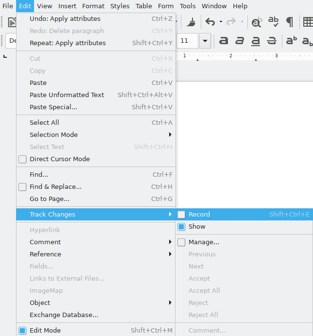
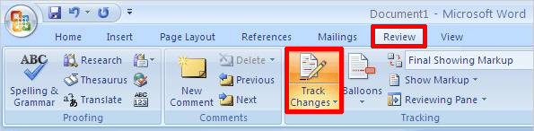
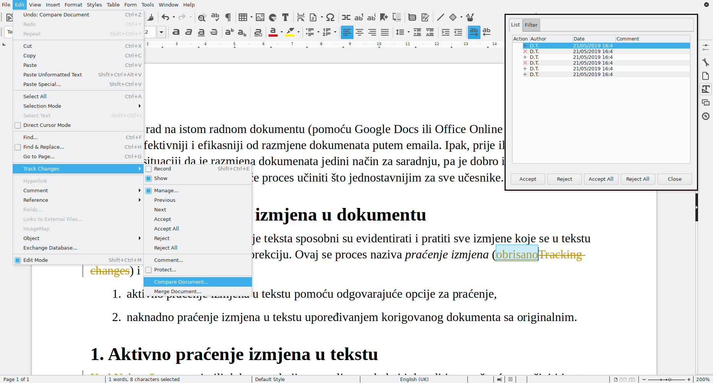
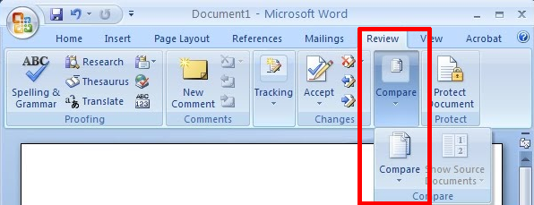
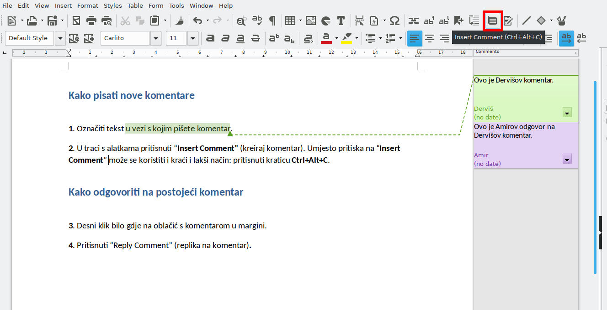
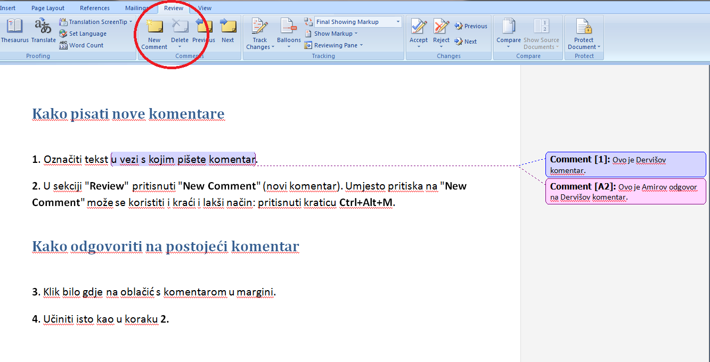
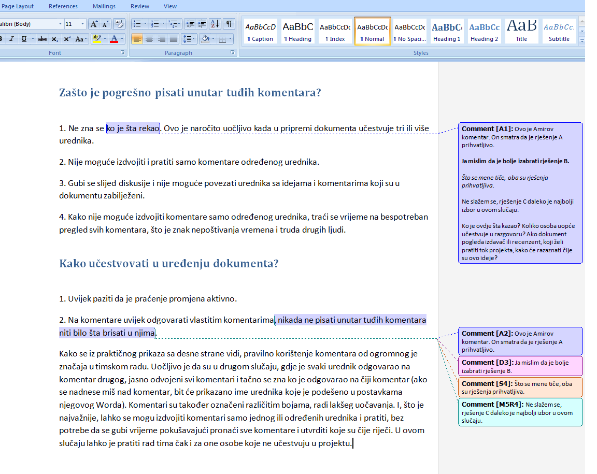
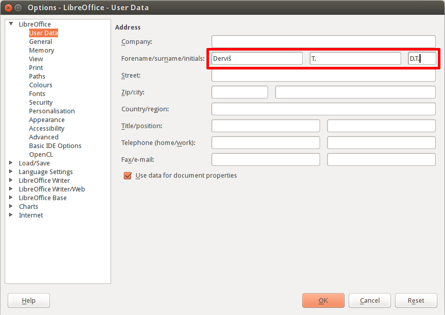
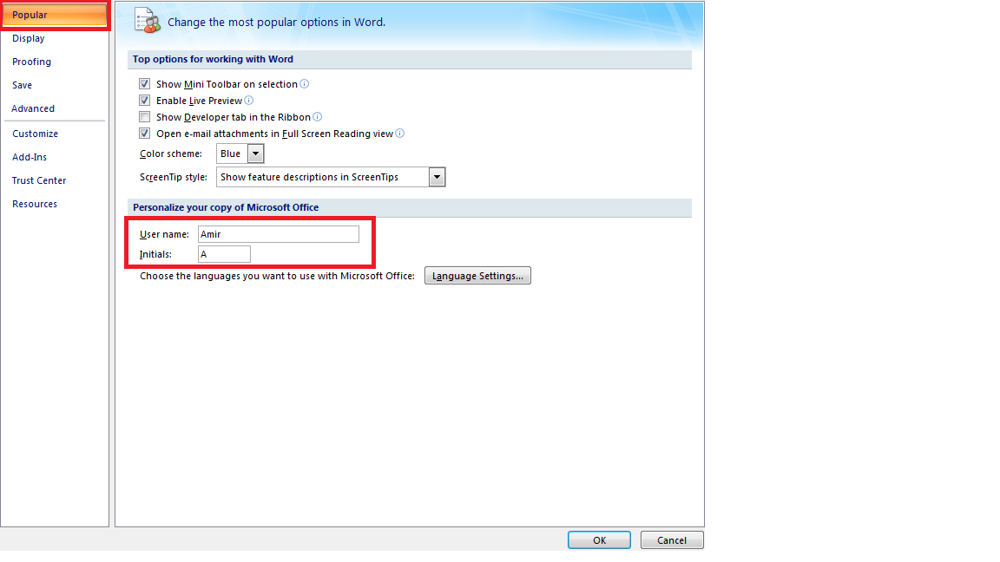

# Praćenje izmjena i pisanje opaski u Writeru i Wordu

Zajednički rad na istom radnom dokumentu (pomoću Google Docs ili Office Online web-aplikacija) znatno je efektivniji i efikasniji od razmjene dokumenata putem emaila. Ipak, prije ili kasnije naći ćemo se u situaciji u kojoj je razmjena dokumenata jedini način za saradnju, pa je dobro imati u vidu nekoliko praktičnih savjeta koji će proces učiniti što jednostavnijim za sve učesnike.

## Bilježenje i praćenje izmjena u dokumentu

Gotovo svi programi za uređivanje teksta sposobni su evidentirati sve izmjene koje se u tekstu načine i naznačiti ko je unio koju korekciju. Ovaj se proces naziva _praćenje izmjena_ (Tracking changes) i može biti dvojak:

1. aktivno praćenje izmjena u tekstu pomoću odgovarajuće opcije za praćenje,
2. naknadno praćenje izmjena u tekstu upoređivanjem korigovanog dokumenta sa originalnim.

### 1. Aktivno praćenje izmjena u tekstu

Nakon što smo primili dokument koji nam valja pregledati i doraditi, prvo što ćemo učiniti jeste aktivirati praćenje izmjena u dokumentu.

**LibreOffice Writer**: Edit > Track Changes > Record (Uredi > Prati izmjene > Bilježi).

**Microsoft Office Word**: Review > Track Changes (Pregled > Prati izmjene).

Alternativno, može se pritisnuti _Ctrl+Shift+E_ kombinacija na tastaturi za brzo aktiviranje ili deaktiviranje praćenja izmjena.


Treba steći naviku da čim otvorimo tuđi dokument, bilo da ga želimo samo pregledati ili i doraditi, odmah pritisnemo Ctrl+Shift+E kombinaciju na tastaturi i aktiviramo praćenje izmjena.


Pošto smo aktivirali praćenje izmjena, možemo početi sa uređivanjem teksta, a svaka naša radnja bit će uredno zabilježena: sve što dodamo u tekst ili izbrišemo bit će označeno odgovarajućom bojom (obično zelenom za dopisani tekst, crvenom za izbrisani) a u margini će biti dodata uspravna crta da označi svaki red teksta u kojem je bilo intervencija, kako bi se one lakše pronašle.

### 2. Naknadno praćenje izmjena u tekstu

S vremena na vrijeme, primit ćemo dokument koji je uređivan bez aktivnog praćenja izmjena, već je sve rađeno ručno: riječi, sintagme, rečenice koje su izmijenjene označene su i pisane masnim slovima, kurzivom ili drugom bojom, komentari su dopisani u sami tekst i stavljeni unutar zagrada i sl. Nekad greške uopće nisu ispravljene, već je samo dopisana riječ, sintagma, rečenica kako bi trebale glasiti, a korigovanje je prepušteno nekome drugom. Sve su ove radnje, pored toga što su u potpunosti bespotrebne, i tegobne, i nekonzistentne, i spore, ali su usto i nepouzdane. Šta ako se neke korekcije ili, gore, komentari zaborave označiti i tako prođu nezapaženi prilikom finalnog pregleda dokumenta i završe u štampanoj verziji knjige? Šta ako se prilikom uređivanja teksta nehotice izbriše rečenica ili paragraf i zaborave ponovo napisati? Šta ako se hotimice ili nehotično izbriše ili izmijeni nešto što se ne bi smjelo brisati ili mijenjati i autor po objavljivanju djela izvrgne poruzi i poniženju?

Sve ove nezgode moguće je izbjeći naknadnim praćenjem izmjena u tekstu: upoređivanjem sadržaja dva dokumenta. Za upoređivanje dva dokumenta preduslov je samo taj da imamo sačuvan originalni dokument, tj. dokument koji smo poslali na pregled nekome, s kojim ćemo, po primitku korekcija, uporediti korigovani dokument. Rezultat upoređivanja dva dokumenta bit će u potpunosti isti kao da je čitavo vrijeme bilo aktivno praćenje izmjena: svaka izmjena načinjena u tekstu bit će označena i prikazana, sve razlike između originalnog i korigovanog dokumenta jasno predočene.

**LibreOffice Writer**: Otvoriti primljeni korigovani dokument > Edit > Track Changes > Compare Document… > odabrati originalni dokument.

**Microsoft Office Word**: Otvoriti program > Review > Compare > Compare > u lijevoj kućici, nazvanoj “Original document”, odabrati originalni dokument, a u desnoj, “Revised document”, odabrati korigovani dokument.


Postoji neznatna razlika u načinu prikazivanja izmjena između Writera i Worda: Writer izmjene prikazuje u odnosu na otvoreni dokument, s popisom izmjena u zasebnom plutajućem okviru, dok Word daje uporedni prikaz oba dokumenta, s popisom izmjena u zasebnom okviru s lijeve ili desne strane. No, princip je isti: sve izmjene načinjene u korigovanom dokumentu jasno su prikazane i možemo ih pregledati, prihvatiti ili odbaciti jednostavno klikom na odgovarajuće dugme (Accept – prihvati; Reject – odbaci) u popisu.


Nakon pregleda svih izmjena, njihova prihvatanja i odbacivanja, preporučeno je konačnu verziju dokumenta pohraniti pod novim nazivom, kako bi i originalni i korigovani dokument ostali netaknuti, sačuvani u svom izvornom obliku, i kao takvi arhivirani. Novokreirani dokument proslijedit će se dalje, u narednu fazu obrade.

## Pisanje opaski, napomena, komentara

Praćenje izmjena omogućava nam da vršimo direktne intervencije u tekstu bez straha da će one proći nezapažene: autor ili urednik tačno će znati ko je i kada načinio koju korekciju u dokumentu. No, nekada sama intervencija u tekstu nije dovoljna već je potrebno autoru ili uredniku skrenuti pažnju na nešto ili pojasniti samu intervenciju. Ovakve opaske nikada ne treba pisati direktno u tekst, već se trebaju koristiti komentari: označit će se tekst u vezi s kojim se piše opaska, a potom otvoriti polje za komentar i opaska napisati.

**LibreOffice Writer**: Označiti tekst > pritisnuti kombinaciju _Ctrl+Alt+C_ na tastaturi.

**Microsoft Office Word**: Označiti tekst > pritisnuti kombinaciju _Ctrl+Alt+M_ na tastaturi.


Kad dokument pregleda više osoba, svaka od njih treba slijediti opisani postupak: označiti tekst > pritisnuti kombinaciju Ctrl+Alt+C ili Ctrl+Alt+M, a potom napisati komentar, čak kad za isti taj tekst već postoji komentar koji je napisala neka druga osoba. Nipošto ne treba vlastiti komentar pisati unutar nečijeg već napisanog komentara, jer osim toga što je izuzetno nepristojno, otežava rad drugim učesnicima i gubi se nit koji je komentar čiji. Treba zapamtiti da je svaki kreirani komentar potpisan i dopisivanjem naših riječi u nečiji komentar mi stvaramo utisak da su i riječi koje smo dopisali ustvari riječi te osobe, a to nije istina i može imati ozbiljne posljedice.


## Identitet: ime, prezime i inicijali

Kako je već naglašeno, svaki komentar i svaka izmjena u dokumentu kad je praćenje izmjena aktivno evidentirani su i potpisani. Sam potpis obično je automatski definisan i nosi ime identično korisničkom imenu na računaru. Ipak, nekad je potrebno kreirati zaseban identitet za rad s dokumentima, koji će se razlikovati od identiteta korisnika čiji profil na računaru koristimo, bilo da je potrebno ime izmijeniti, upotpuniti ili u potpunosti sakriti a umjesto imena koristiti samo inicijale.

**LibreOffice Writer**: Tools > Options > User Data (Alati > Opcije > Korisnički podaci). Unijeti ime, prezime i/ili inicijale.

**Microsoft Office Word**: Okruglo dugme u gornjem lijevom uglu > Word options > Popular. Unijeti ime, prezime i/ili inicijale.

