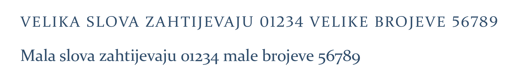
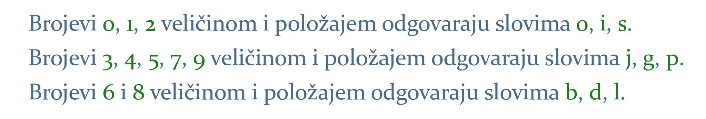
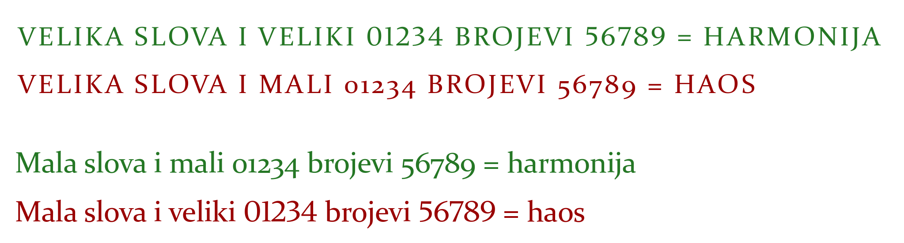
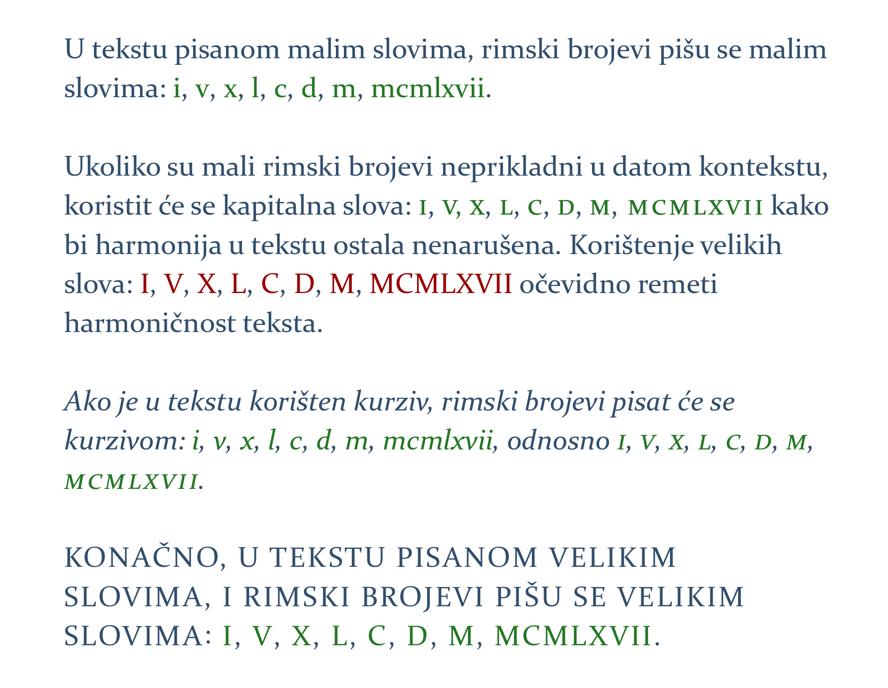
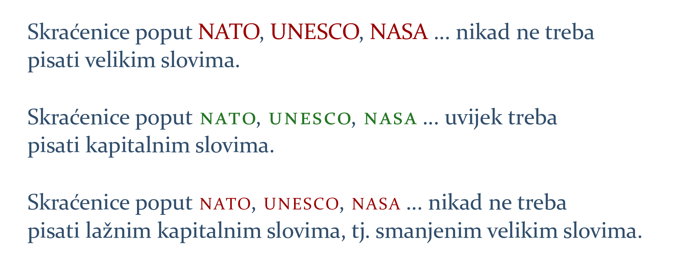

# Brojevi i slova – vrste i slaganje

Jedan od zadataka knjižnog dizajnera jest kreiranje kontekstualne i vizuelne harmonije na stranicama knjige. U kolikoj će mjeri u tome biti uspješan uvelike zavisi od toga je li dizajner skladno kombinovao slova i brojeve ili ne. Ukoliko ne uočava razliku između vrsta i oblika brojeva i slova, ne razumije svrhu i značaj njihovog valjanog kombinovanja i stoga ih nasumično ili sasvim pogrešno koristi u tekstu, dizajner neće biti u stanju kako treba obaviti zadatak koji mu je povjeren. Slaganje brojeva i slova jedno je od temeljnih tipografskih pravila.

## Arapski brojevi

Pravilo o slaganju brojeva i slova konkretno je i jasno: ako je tekst pisan velikim slovima \(npr. naslovi\), tada će se koristiti i »veliki« brojevi \(engl. titling figures\). U svim drugim situacijama koristit će se »mali« brojevi \(engl. text figures\):

Karakteristika je velikih slova, kao i velikih brojeva, da su jednake veličine i bez varijacija u položaju. Uočljiva su na stranici, što ih čini pogodnim za naslove, ali ne i za obični tekst: velika slova otežavaju raspoznavanje oblika riječi, neugodna su za duže čitanje i zamaraju oko.

Kod malih slova, s druge strane, postoje varijacije i u veličini i u položaju – mala su slova ciljano dizajnirana na takav način da bi se oblik riječi što lakše prepoznao i olakšalo čitanje. Neka su mala slova manja \(npr. i\), neka veća \(npr. d\), neka se protežu iznad linije \(npr. b\), a neka ispod \(npr. g\).

Brojevi se ponašaju identično slovima: kako veliki brojevi odudaraju od teksta pisanog malim slovima, bilo je neophodno dizajnirati male brojeve, koji se, s obzirom na to da su sličnih karakteristika kao i mala slova, savršeno uklapaju u tekst.

Nema alternative za korištenje odgovarajućih brojeva u datom kontekstu i ono je neophodno da bi se ostvarila harmonija na stranici. Neprepoznavanje veze između slova i brojeva rezultirat će nastankom haosa:

## Rimski brojevi

S obzirom na to da se za pisanje rimskih brojeva koriste latinična slova, način pisanja brojeva zavisit će od konteksta: ako je tekst pisan malim slovima, tada treba i brojeve pisati na isti način; ako je tekst pisan velikim slovima, i brojeve treba pisati velikim slovima:

## Velika i kapitalna slova

Ostvarenje harmonije na stranici ne zavisi samo od korištenja odgovarajuće vrste brojeva, već i slova: pisanjem jedne ili više riječi velikim slovima u tekstu napisanom malim slovima narušit će se harmoničnost teksta. Da bi se to izbjeglo, dizajnirana je posebna vrsta velikih slova namijenjena za korištenje u tekstu, »kapitalna« slova \(engl. small caps\), koja neće kreirati haos na stranici kako to redovno čine velika slova, već će se lijepo uklopiti u okolni tekst:


Veliki broj aplikacija ne koristi prava kapitalna slova, kreirana rukom dizajnera, već generišu lažna kapitalna slova tako što smanje velika slova. Ovakva slova veoma su uočljiva usljed istanjenih linija i odudaraju od teksta. Lažna kapitalna slova nipošto ne treba koristiti u tekstu.


—

[Prilog o slaganju brojeva i slova](https://drive.google.com/file/d/1gwnr9JFqrxVsHYWVvU-WLmHGY9Ay4UVO/view?usp=sharing). Preuzeto iz:  

Robert Bringhurst, _The Elements of Typographic Style_, 3rd Ed.    
Ellen Lupton, _Thinking With Type_, 2nd Ed.

