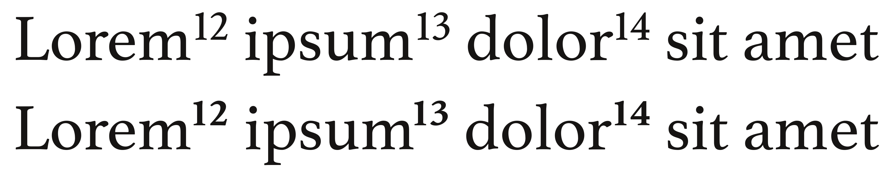
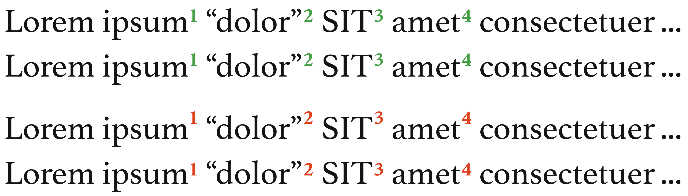
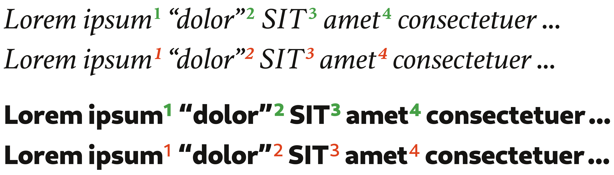
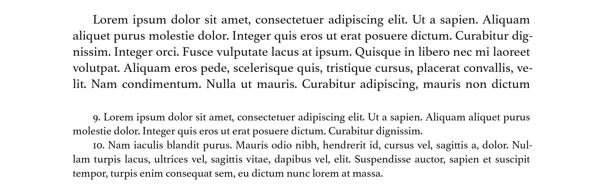
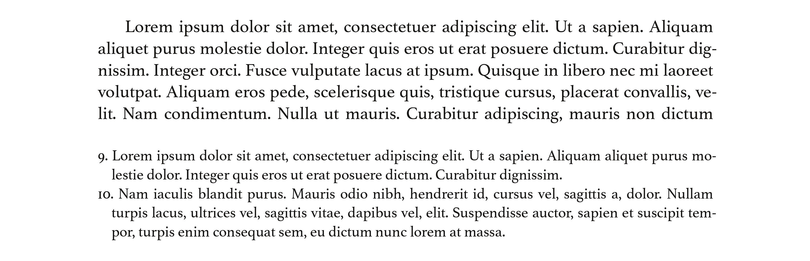
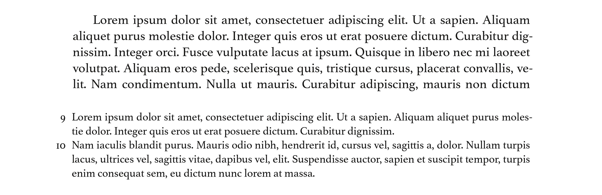
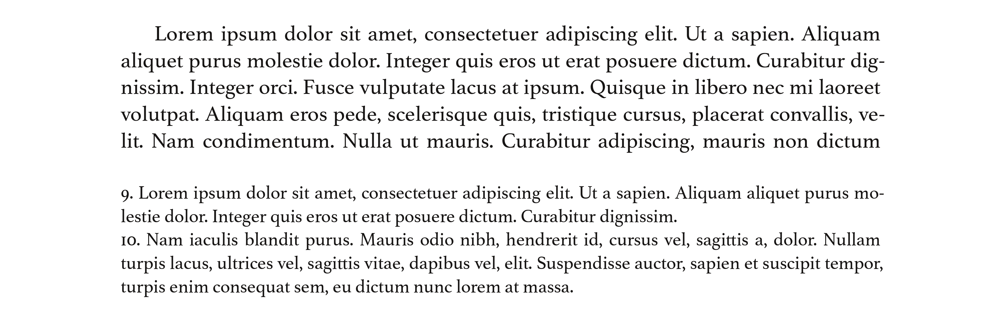
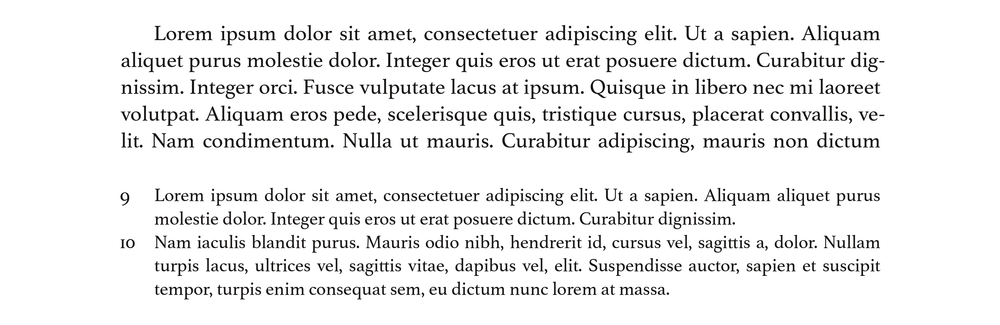
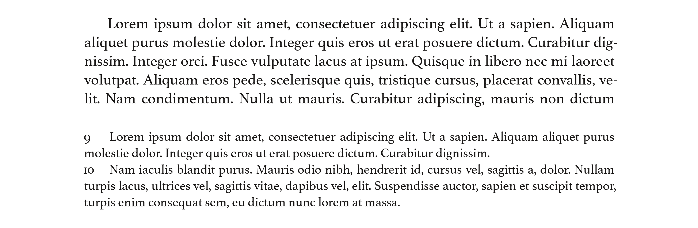
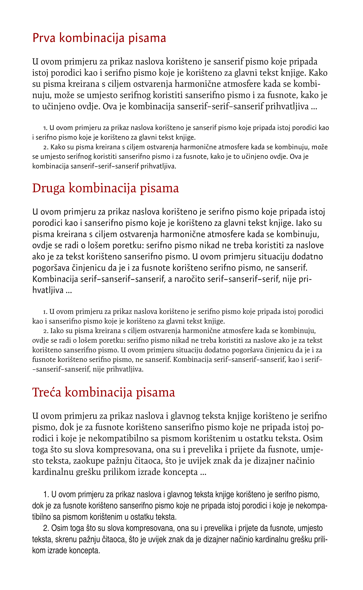

# Fusnote – način obilježavanja i pisanja

[Oznaka za fusnotu u tekstu](fusnote-nacin-obiljezavanja-i-pisanja.md#oznaka-za-fusnotu) • [Numerisanje fusnota](fusnote-nacin-obiljezavanja-i-pisanja.md#numerisanje-fusnota) • [Odvajanje fusnote od teksta](fusnote-nacin-obiljezavanja-i-pisanja.md#odvajanje-fusnota-od-teksta) • [Broj ispred teksta fusnote](fusnote-nacin-obiljezavanja-i-pisanja.md#broj-ispred-teksta-fusnote) • [Problematični načini pisanja fusnota](fusnote-nacin-obiljezavanja-i-pisanja.md#problematicni-nacini-pisanja-fusnota)

## Oznaka za fusnotu u tekstu {#oznaka-za-fusnotu}

Mjesto u tekstu za koje se fusnota vezuje najbolje je označiti simbolom \*, ako na stranici nema više od jedne fusnote. Ali, ako su fusnote brojne, tada se za oznake koriste smanjeni arapski brojevi, koje treba podignuti od bazne linije. Ovi brojevi poznati su kao “superscript” brojevi. Većina pisama ima posebno dizajnirane superscript, smanjene brojeve. Treba povesti računa o tome da se ne koriste ručno ili automatski smanjeni obični brojevi, kako se, nažalost, često primijeti u knjigama pripremljenim pomoću aplikacija koje posjeduju veoma ograničene mogućnosti za primjenu tipografskih konvencija, jer će se smanjivanjem ovih brojeva smanjiti i debljina linija, što će, naročito u slučaju dvocifrenih brojeva fusnota, kreirati očigledni vizuelni nesklad, a brojevi će izgledati istanjeni, anemični. To se jasno primijeti na sljedećoj ilustraciji u kojoj su u prvom retku korišteni lažni superscript brojevi, koje je generisao softver tako što je smanjio obične brojeve, dok su u drugom korišteni pravi superscript brojevi, koje je kreirao dizajner pisma i koji se savršeno uklapaju u tekst:

Iako većina aplikacija za uređenje teksta i bez posebnih podešavanja koristi upravo ove brojeve, bilo prave bilo lažne, ipak treba spomenuti da neke aplikacije ne pozicioniraju broj kako valja: ili ga podignu premalo, ili previše. Broj fusnote treba pozicionirati tako da je vrh broja u istoj ravni sa vrhom velikih slova. Alternativno, pozicija broja sravnit će se sa pozicijom navodnika “ i ”. Koji će se metod primijeniti zavisit će od dizajna pisma i položaja fusnota u tekstu.

## Numerisanje fusnota {#numerisanje-fusnota}

Fusnote se mogu obilježavati brojevima od 1 pa dalje, sve do kraja knjige. Ako fusnote nisu brojne, ovo je najjednostavniji način za označavanje fusnota. No, ako je knjiga prepuna fusnota, praktičnije je numerisati ih po poglavljima, tj. od 1 pa dalje do kraja trenutnog poglavlja, a potom ponovo početi numerisanje od broja 1 za svako naredno poglavlje. Razlog za ovakav način numerisanja jeste taj što fusnote, ako su brojne, mogu dostići trocifrene, nekad i četverocifrene brojeve, što je nedopustivo – nepraktično je, otežava snalaženje u tekstu i narušava vizuelnu kompaktnost stranice.

Fusnote se mogu numerisati i od 1 pa dalje u sklopu jedne stranice, odnosno, svaku prvu fusnotu na novoj stranici označiti brojem 1. Ovako numerisane, fusnote neće biti upadljive i neće otežavati čitanje teksta, jer u većini slučajeva broj fusnota na stranici neće preći 9, bit će jednocifren – ako su fusnote brojne, one će i tada imati najviše dvije cifre.

Brojevi kojima se označavaju fusnote u tekstu nikada se neće pisati kurzivom, čak ni onda kada se nalaze u odjeljku teksta koji je u cijelosti pisan na takav način. Međutim, ukoliko se nađu u tekstu koji je pisan masnim slovima, tada i brojeve za označavanje fusnota treba pisati na isti način, masnim slovima.

## Odvajanje fusnote od teksta {#odvajanje-fusnota-od-teksta}

Fusnota će se od teksta odvojiti prazninom. Praksa odvajanja fusnota tankom horizontalnom linijom dugom nekoliko centimetara, kakva se može vidjeti u memorandumima, esejima i skriptama, nepodobna je za većinu knjiga i nikada nije naišla na podršku stručnjaka, naprotiv, neki su tipografi jasno istaknuli da je korištenje ove linije loša praksa. Ako se linija, iz nekog razloga, mora pozicionirati iznad fusnote, preporučuje se da se ona produži tako da širinom odgovara širini teksta i tako makar malo umanji vizuelni nesklad koji kratka linija unosi na stranicu.

Nema neke definitivne mjere za razmak kojim će se fusnota odvojiti od teksta, ali u praksi on nikad ne bi smio biti manji od razmaka između dva reda teksta, odnosno praznina bi trebala iznositi makar pola praznog retka. Prazni će red, ili pola retka, u većini slučajeva sasvim lijepo poslužiti svrsi. Mogu se tolerisati i dva prazna retka, ali ni u ovom pogledu ne treba pretjerivati – tri ili četiri prazna retka kreirat će nepremostivi jaz između teksta i fusnote.

## Pisanje broja ispred teksta fusnote {#broj-ispred-teksta-fusnote}

Najčešće se koristi jedna od tri metode pisanja broja ispred teksta fusnote: \(1\) uvučeni, \(2\) viseći i \(3\) poravnati.

**1. Uvučeni broj fusnote**. Prilikom primjene ovog metoda, nakon broja fusnote piše se tačka, potom razmak, a onda počinje tekst fusnote. Ovaj je metod pogodan ako su fusnote duže i obuhvataju makar dva ili više redova teksta. Kako je anatomija fusnote identična anatomiji glavnog teksta, neće doći do vizuelnih poremećaja na stranici i cjelokupni tekstni blok na stranici izgledat će kao kompaktna cjelina.

**2. Viseći broj fusnote**. Prilikom primjene ovog metoda, broj ispred fusnote “visi”, dok je sam tekst fusnote pomjeren nekoliko milimetara udesno i poravnat. Broj fusnote odvojen je od teksta fusnote jednim ili dva razmaka, ili tačkom i razmakom. Kako je broj fusnote poravnat sa lijevom stranom teksta, ovaj je metod pogodan u onim situacijama kada su fusnote kraće i obično ne zauzimaju više od jednog reda teksta, jer će minimizirati pojavu bjelina uz lijevu marginu koje narušavaju boju stranice.

Broj fusnote može se pisati i u samoj lijevoj margini, usljed čega će lijeva strana teksta u fusnoti biti poravnata sa lijevom stranom glavnog teksta. Ovaj je metod praktičan za korištenje u svim prilikama, i kad dominiraju duže fusnote, ali isto tako i kada je većina fusnota kratka, jer ne narušava ni kompaktnost niti boju stranice. Pored toga, brojevi unutar lijeve margine, izdvojeni iz samog tekstnog bloka, u znatnoj mjeri olakšavaju pronalazak tražene fusnote.

**3. Poravnati broj fusnote**. Prilikom primjene ovog metoda, lijeva strana teksta fusnote poravnata je s lijevom stranom glavnog teksta. Broj fusnote odvojen je od njenog teksta jednim ili dva razmaka, odnosno tačkom i razmakom. Ovaj metod osigurava vizuelni sklad na stranici, ali kako se broj fusnote ni na koji način ne izdvaja od teksta fusnote, to će otežati pronalazak tražene fusnote.

## Problematični načini pisanja fusnota {#problematicni-nacini-pisanja-fusnota}

U knjigama se često mogu pronaći neki metodi pisanja fusnota koje svakako treba izbjegavati, jer narušavaju boju stranice ili remete sklad u organizaciji teksta na stranici, dok istovremeno ne osiguravaju dodatnu korist koja bi makar djelimično opravdala njihovo korištenje. Pored rasprostranjene loše prakse da se brojevi ispred teksta fusnota pišu smanjenim podignutim brojevima \(superscript\), obično se radi o varijantama jednog od navedenih validnih metoda oblikovanja fusnota.

**1. Varijanta metoda visećeg broja fusnote**. Prilikom korištenja ovog metoda, sve linije teksta fusnote poravnavaju se sa uvučenom prvom linijom paragrafa u glavnom tekstu. Ovaj će metod gotovo uvijek dovesti do nesklada na stranici, kreirajući bjeline u donjem lijevom dijelu stranice i efektivno “potkopavajući” glavni tekst; što su fusnote brojnije i što je prva linija paragrafa glavnog teksta više uvučena, to je nesklad na stranici veći. Ipak, ako je prva linija paragrafa glavnog teksta uvučena 4 ili 5 mm, i ako su fusnote pretežno kratke, tada će korištenje ovog metoda biti poput metoda visećeg broja fusnote.

**2. Varijanta metoda poravnatog broja fusnote**. Prilikom korištenja ovog metoda, broj fusnote poravnat je s lijevom stranom glavnog teksta, a početak teksta fusnote poravnava se sa uvučenom prvom linijom paragrafa glavnog teksta. Ovaj je metod uvijek problematičan, jer stvara vizuelni nesklad usljed bjelina kojima je prošarano dno stranice; što je prva linija teksta više uvučena, to je nesklad veći. Ako je prva linija teksta uvučena 4 do 5 mm, tada će ovaj metod biti gotovo identičan metodu poravnatog broja fusnote.

**3. Odstupanje od stila teksta na stranicama**. Fusnote moraju slijediti stil koji je korišten za ostatak teksta na stranici. Tako će one biti pisane istim pismom kao i ostali tekst, ali redovno dva ili tri pointa manjim. Manja slova ukazuju na komplementarnu prirodu fusnota – iako su dio teksta, njihova je funkcija pomoćna; fusnote mogu biti potpuno ignorisane prilikom čitanja knjige. Za fusnote se mora koristiti i isti metod poravnanja teksta: ako je tekst na stranicama poravnat sa obje strane, tako treba biti poravnat i tekst u fusnotama; ako je tekst poravnat samo s lijeve strane, tada će se isto poravnanje koristiti i za fusnote.

Fusnote nikad ne smiju biti pisane slovima iste veličine kao što su slova u glavnom tekstu, niti pismom koje je toliko drugačije od ostatka teksta da redovno na sebe skreće pažnju čitaoca. Ako fusnote nisu brojne i duge, može se u nekim djelima umjesto istog pisma koje je korišteno za ostatak teksta upotrijebiti kompatibilno alternativno pismo. Naprimjer, ako je za tekst korišteno serifno pismo, može se za fusnote koristiti prikladno sanserifno pismo \(najbolje je ako su oba pisma dio iste familije pisama, dizajniranih slijedeći zajednički cilj i svrhu, i pridržavajući se istih principa i metoda prilikom kreiranja pisama\), pod uslovom da se time ne stvara vizuelni nesklad i ne skreće pažnja čitaoca sa teksta. Oba pisma u svakom slučaju trebaju posjedovati slične karakteristike \(debljina linija, visina slova i njihova širina\), kako bi tekst bio skladno prezentovan.

## Bilješke

