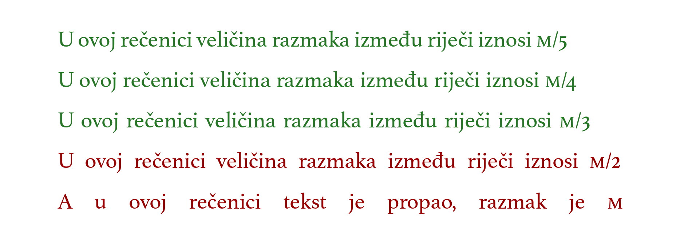
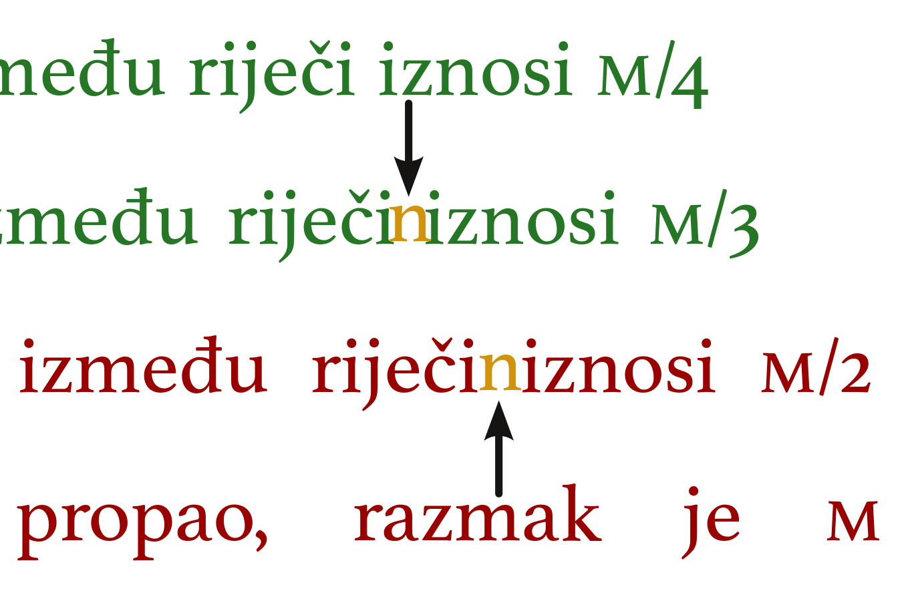

# Razmak između riječi u tekstu

Veličina razmaka između riječi u vezanom tekstu poravnatom s obje strane \(većina knjiga\) varira od retka do retka. Istovremeno sa ulogom razdvajanja riječi, razmak ima i suprotnu funkciju – funkciju spajanja: prikladni razmaci drže riječi na okupu, dok preveliki razmaci između riječi ostavljaju utisak rasturenog, razasutog teksta čiji su šavovi evidentno popucali i rasuli se.

Koliki razmak između riječi treba biti? Odgovor na ovo pitanje ne može biti apsolutan. Veličina razmaka zavisi od niza faktora poput vrste pisma, jezika, veličine slova i sl. Ipak, to ne znači da mjere ne postoje i da ih nije moguće utvrditi.

Temeljna jedinica za mjerenje razmaka relativnog je karaktera i ona je _jedan em_ \(1 em\), gdje _em_ predstavlja mjeru koja odgovara veličini slova; ako su u tekstu korištena slova veličine 11 pt, tada važi: 1 em = 11 pt. Približno, 1 em odgovara širini velikog slova m.

1. U običnom tekstu, minimalna veličina razmaka između riječi iznosi petinu ema \(M/5\). Razmak manji od toga nije dovoljan da jasno razdvoji riječi, što će otežati čitanje.
2. U običnom tekstu, veličina razmaka između riječi kojoj treba težiti iznosi četvrtinu ema \(M/4\). Približno, to je širina malog slova t i predstavlja optimalni razmak.
3. U običnom tekstu, maksimalna veličina razmaka između riječi koja se ne bi trebala prekoračiti iznosi trećinu ema \(M/3\). Razmak veći od toga dovodi do propadanja pogleda između riječi i što je razmak veći, to je čitanje neugodnije a stranica izgleda neskladnija, prorešetana bjelinama.

Veličina razmaka između riječi veća od trećine ema može se koristiti u posebnim slučajevima, poput teksta pisanog velikim slovima, gdje je povećan i razmak između _slova_, pa je stoga neophodno povećati i razmak između _riječi_. Također, u nekim pismima, naročito ako su korištena masna slova, može se ukazati potreba za većim razmakom. Međutim, očigledno je da je mjera od, recimo, polovine ema neprikladna za vezani tekst, kao i svaki razmak veći od toga.

Da je razmak između riječi u tekstu prevelik možemo lahko ocijeniti od oka, koristeći malo slovo n: ako između riječi možemo pozicionirati slovo n tako da ono ne dodiruje ni zadnje slovo prethodne, ni prvo slovo naredne riječi, to je jasan pokazatelj da nismo uradili kvalitetan prijelom paragrafa i da njegovu strukturu treba doraditi i korigovati veličinu razmaka.

Korekcija razmaka sastojat će se od davanja novih smjernica softveru u vidu smanjenja tolerancije koja se odnosi na razmake ili ponovnog prijeloma riječi na kraju retka u paragrafu kako bi se razmaci sveli na prihvatljiv nivo.

